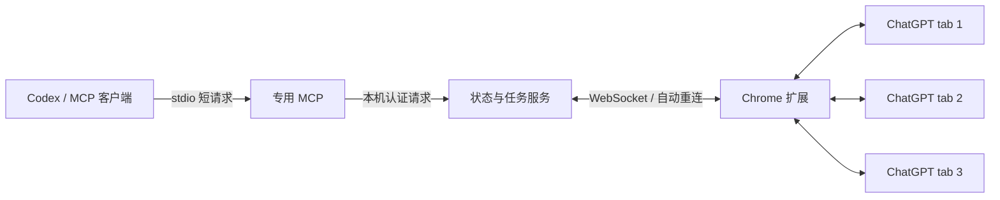

# ChatGPT Web Bridge

通过本机 Chrome 扩展控制已登录的 ChatGPT 网页。**2026-09-09 已在一台 Windows 电脑完成真实验收**：三个独立 tab 并发生图、选择并确认 GPT-5.5、查询生成状态、获取对应回答、下载并验证三张原图。本仓库提供源码；新环境需要自行生成本机配置、加载扩展并注册 MCP。

五个 ChatGPT tab、三个已完成任务的实测：MCP 全部状态缓存查询中位 **2.78 ms**，主动刷新中位 **18.95 ms**。这是本机短时样本。详见 [验收记录](ACCEPTANCE.md) 和 [安装与开发记录](WORKLOG.md)。

0.2.1 起，每项任务独占并串行复用一个 tab，不同任务可以在同一 Chrome profile 的不同 tab 并行。保存和归档后显式释放；达到 4 个已打开或已预留 tab 且无空闲页才等待。

## 工作方式

提示词提交后返回持久化 `runId`，网页继续生成。后续查询使用短请求，不必让一个 MCP 调用一直等待生图完成。每个 tab 使用 Chrome profile、浏览器会话、tab ID 组合标识。



扩展观察网页控件并推送状态。`connection` 表示扩展连接，`activity` 表示网页活动，`freshness` 表示观测时间。断线、页面冻结、被丢弃或超过 30 秒没有观测时，活动返回 `unknown`；历史已完成任务及已验证文件仍可查询。

模型字段来自网页选择器。当前实测显示 `5.5\n即时`，对应模型菜单中选中的 `GPT-5.5`。`actualBackendModel:null` 表示不能从网页确认实际处理响应的后端模型。

## 组件与依赖

- Chrome 扩展 **ChatGPT Web Bridge (local)**，由本机 setup 生成。
- Codex stdio MCP **chatgpt-web-bridge**，提供 13 个工具。
- Skill **chatgpt-chrome-bridge**，源码见 [skill/SKILL.md](skill/SKILL.md)，可复制到个人 Codex skills 目录下的同名文件夹。
- 项目依赖：`@modelcontextprotocol/sdk@1.30.0`、`ws@8.21.3`、调研用 `chrome-devtools-mcp@1.9.0`；测试依赖 `jsdom@29.0.2`。使用现有 Node 24.13.0。

日常使用只需专用 Chrome 扩展和 MCP/CLI 服务。扩展权限为 `https://chatgpt.com/*`、storage、scripting、downloads、alarms、declarativeNetRequestWithHostAccess。运行桥接不依赖 Chrome DevTools MCP，不需要远程调试。

每次通过桥接发送消息前，扩展会通过 Chrome 网络规则阻止所有 ChatGPT tab 对 `/backend-api/conversations` 的 XHR/fetch 请求（包括查询参数）30 秒，以避免多 tab 同步刷新会话列表放大限流；30 秒内再次发送会重置倒计时。发送消息使用的单数路径 `/backend-api/conversation` 不受影响。规则作用范围是当前 Chrome profile 中安装此扩展的 tab，不影响其它 Chrome profile。

## 使用

可直接对 AI 说：“使用 chatgpt-chrome-bridge，查看 Chrome 中所有 ChatGPT 标签页的模型与生成状态”，或“使用 Chrome 网页版 ChatGPT，串行生成两张图，复用一个 tab 并保存原图”。

当前任务未加载新 MCP 工具时，Skill 可调用同一服务的 CLI：

```powershell
node src/cli.mjs health
node src/cli.mjs status
```

带参数时先写 UTF-8 JSON 文件，再用 `node src/cli.mjs <method> --input <参数文件>`。主动刷新参数是 `{"refresh":true}`。MCP/CLI 按需启动本机服务，Windows 使用隐藏后台窗口，没有创建开机任务。

| MCP 工具 | 作用 |
|---|---|
| `chatgpt_task` | 单 tab 任务占用；有容量即可并行，满额无空闲才等待；保存／归档后 release；已确认关闭且无未完成 run 的 tab 自动释放 |
| `chatgpt_tabs` | 列出当前清单；持有 leaseId 且少于四个 tab 时以 `action:new,count:1` 新建一页；`action:close` 关闭本任务占用的指定页 |
| `chatgpt_new_chat` | 在指定的同一个 tab 点击“新聊天”，确认空白输入框；串行生图先保存上一张原图再调用 |
| `chatgpt_status` | 查询模型、活动、连接、新鲜度、任务；`refresh:true` 并行探测 |
| `chatgpt_models` | 读取菜单勾选的模型名称和当前推理强度；必要时关闭没有草稿的图片查看器 |
| `chatgpt_select_model` | 按精确标签选择并读回，检查 `confirmed:true` |
| `chatgpt_send` | 发送文字、图片或文件，返回持久化 run；必须提供稳定 requestId |
| `chatgpt_access` | 查询／记录暂停，5 分钟自动检查恢复；wait 保持任务等待，恢复后继续原步骤 |
| `chatgpt_result` | 按 runId 默认返回对应回答的完整正文和图片信息；需要图片哈希时传 `includeAssets:true` |
| `chatgpt_download` | 点击对应图片保存控件，验证下载文件，返回路径 |
| `chatgpt_recover_images` | 网页保存没有产生本机文件时，经同一扩展传输已加载的同源原图字节，并核对哈希 |
| `chatgpt_stop` | 停止指定 run 的当前生成 |
| `chatgpt_wait` | 最长 25 秒等待状态变化，超时后可继续查同一 run |

MCP 返回 structuredContent JSON，并附带相同内容的文本。状态字段示意如下，实际结果还包含 tabKey、网址和任务信息：

```json
{
  "model": {"label": "5.5\n即时", "name": "GPT-5.5", "reasoningEffort": null, "nameSource": "model_control", "nameIsCached": false, "source": "visible_model_picker", "actualBackendModel": null},
  "activity": "idle",
  "connection": "connected",
  "freshness": {"ageMs": 18, "stale": false},
  "surface": "conversation",
  "composerReady": true
}
```

`model.label` 保留选择器原文，`model.name` 返回模型选项名称，`reasoningEffort` 返回推理强度。新版 composer 的滚动“最新”选项只显示“中／高／即时”等标签，v42 按这项已实测布局返回 `name:最新`（英文为 Latest）、`nameSource:latest_selector`，不会猜测具体模型版本。菜单里的“最新”同样是可选择并验证的有效名称。带版本前缀的旧模型返回对应型号。`models` 的 checked_model_menu 来源表示这次已勾选项，status 的 nameIsCached/nameObservedAt 标明此前缓存；切换选择器标签或会话路径清除缓存。无法识别时仍返回 null。弹窗下可读控件标记 obscured_model_picker/selectorVisible:false，不能穿过弹窗点击。send.expectedModel 使用精确 label；actualBackendModel 仍为 null。

`generating` / `thinking` 表示页面活动。`run.phase:completed` 和 `completionReason:response_finished` 只表示本次网页回答已经结束：已关联本次用户消息及新回答，页面空闲，取得回答结束证据并稳定 2.5 秒。adapter v33 被动记录网页自身的响应流 Resource Timing；本次提交之后成功结束的响应流可作为证据，不要求复制／下载按钮出现，也不要求图片加载。`completionEvidence.source:response_stream_end` 附带流开始／结束时间；缺少可用时序时仍可使用 `response_actions` 控件证据，不仅凭长时间空闲推定完成。旧请求、不同文档／用户消息、仍在生成及未知／过期观察不能据此完成。纯文字、拒绝说明、无图回复及图片尚未加载的回复都可完成，`kind` 不参与完成判断。新请求默认 `kind:text`；已有 requestId 的默认类型保持原值，确保升级后仍可幂等重查。

后台 tab 的定时器可能被浏览器节流。仅在已提交且尚未结束的任务上，服务会补充有界 DOM 探测：同一 tab 正常间隔至少 3 秒、最多 4 个并发、单次超时 2 秒，失败逐步退避至 30 秒；近期已有新观察时跳过，任务结束／访问暂停后停止。探测不激活 tab、不刷新网页、不请求会话列表或图片。默认状态查询仍直接读取缓存。

图片加载不重置回答内容的稳定计时。`wait` 在任务结束后立即返回，不再等待图片；完成是否满足提示词、是否真的生图，由调用方检查结果。`imageCount` 是已观测图片数，`loadedImageCount` 是加载成功数，`downloadCount` 是已验证保存的文件数。

## 发送图片和文件

`chatgpt_send` 和 CLI 的 `send` 共用 `attachments` 参数，每项可提供本机文件的绝对路径，或直接传入图片／文件内容，无需先写入临时文件。支持文字加附件，也可省略 `prompt` 只发附件；`kind` 仍表示期望的回答类型，不表示附件类型。

直接传图片内容（`data` 也可填标准带 padding 的纯 base64，此时可用 `mimeType:"image/png"` 指定类型）：

```javascript
chatgpt_send({
  tabKey, leaseId,
  requestId: "pasted-image-001",
  prompt: "分析这张图片",
  attachments: [{
    name: "reference.png",
    data: "data:image/png;base64,<图片内容>"
  }]
})
```

`name` 是带扩展名的文件名，不能含目录。`mimeType` 可省略，默认从 data URL 或文件扩展名识别；同时指定时须与 data URL 一致。普通文件同样可用 `{name:"report.pdf",mimeType:"application/pdf",data:"<base64内容>"}`。`data` 不接受远程 URL，也不自动下载链接。单个附件使用 `path` 或 `name/data` 其中一种，同一消息可混合两种来源。示例中的内容占位符需替换为实际编码。

从本地路径发送：

```javascript
chatgpt_send({
  tabKey, leaseId,
  requestId: "review-reference-001",
  prompt: "结合参考图和说明文档，分析设计要求。",
  attachments: [
    { path: "E:\\Materials\\参考图.png" },
    { path: "E:\\Materials\\说明.pdf" }
  ]
})
```

桥接器每条消息最多接收 10 个文件、总计 20 MiB（按解码后的字节计算），文件名须互不重复。服务读取文件或解码直接传入的内容并计算 SHA-256，通过已认证的本机连接将字节交给扩展；网页使用文件输入框或粘贴事件上传，不需要改写系统剪贴板。网页自身的文件格式、账号和模型限制仍适用。历史 run 保存文件名、类型、大小、哈希及本地来源的路径，不保存文件正文或 base64。

附件发送会立即返回持久化的 `runId`，最初可能为 `submitting`。继续通过 `status` / `wait` 查询，再用 `result` 获取回答。网页最多等待 90 秒确认附件卡片齐全、上传进度结束且发送按钮可用，然后点击发送；上传失败、超时、草稿或模型被修改时不会点击发送，保留草稿供检查。纯文本如果由 bridge 刚刚写入草稿、并在点击前明确遇到限流，adapter 会清掉这次自有草稿，服务在恢复后用同一个 run/request 自动重试；人工或被修改的草稿不会覆盖。`submission_unknown` 仍须查询原 run，不能换 requestId 重发。

同一 requestId 的重查也校验附件来源、文件名、类型及内容；直接传入的纯 base64 和 data URL 在解码内容及元数据一致时视为同一请求。本地路径方式须保持原文件可读且内容不变；文件变更或增删附件会被拒绝，重复请求不会再次上传。文件已经移动或删除时，直接用原 `runId` 查询。附件草稿会阻止新聊天、关闭页面和释放占用，避免丢失尚未发送的内容。

当前功能使用 **adapter 50 / content 6**；附件最低要求 adapter 46，图片额度外部提示和长回答采集需要 adapter 50。升级源码后运行 `npm run setup`，重新加载 Chrome 扩展及需要发送附件的目标页面，并重启桥接服务、重新加载 MCP 工具定义。旧观察器会明确拒绝附件请求。附件流程已通过模拟 DOM 和本机服务集成测试，尚未进行真实 ChatGPT 上传验收。

## 查询网页回答

`chatgpt_result({runId})` 默认读取绑定到该任务的 assistant 正文和图片信息，不读取其他聊天或其他回答。回答正在输出时也能查询已有内容，`result.complete:false` 表示这份内容尚未确认完整。完成判定以网页原生控件为准：可用的 Stop 控件表示仍在执行；当前图片渲染阶段即使没有 Stop，也会由 assistant turn 内的 `role=progressbar` 保持 `generating`，不会根据 assistant 文案或 response stream 单独判定完成。只有网页实时控件退出执行后才按正常完成语义处理。普通文字拒绝作为网页正文返回，不额外猜测拒绝分类。例如回答已经结束且没有图片时，返回字段节选为：

```json
{
  "run": {"phase": "completed", "completionReason": "response_finished"},
  "result": {
    "assistantId": "example-assistant-id",
    "text": "无法根据该请求生成图片。",
    "complete": true,
    "images": [],
    "assets": []
  },
  "resultSource": "live"
}
```

`result.images` 包含网页中实际观察到的图片 URL、尺寸、alt、`loaded` 和 `loadState:loaded|pending|error`，也包括小图及加载失败的图片。默认读取这些信息不下载图片或计算哈希，因此媒体问题不会阻断正文读取。`includeAssets:true` 才额外读取已加载的同源图片字节并计算 SHA-256，成功的哈希位于 `assets`；单张失败在该图片的 `assetError` 中说明。`includeText:false` 保留为仅查询 run 元数据的兼容参数。

图片额度耗尽时，`result.imageQuota` 会保留网页原文并返回结构化时间：`resetAt` 是 ISO 绝对时间，`resetAtOffset` / `resetAtLocal` 是桥接器本机时区的可读时间，`timeZone` 标明时区。页面同时给出“明天 02:04”和“4 小时后”时优先使用前者；只有相对时长时才按回答完成时的观测时间换算，并将 `source` 标记为 `relative_text`、`precision` 标记为 `relative`，不把推算冒充网页给出的精确分钟。若网页没有重置时间，`resetAt` 为 `null`、`source` 为 `unavailable`。

例如，`你已达到 Plus 套餐的图像生成请求上限。上限将在 4小时 后重置` 会返回 `result.imageQuota.resetAt`，而不是只让调用方自行解析 `4小时`。页面外层或长 assistant 回答中的额度提示会由 adapter 50 的 `imageQuotaText` 一并采集；升级后运行 `npm run setup` 并刷新观察器。

已查询过的正文和图片信息会缓存。原页面离开或断线后，可返回 `resultSource:cache` 及该份内容的 `observedAt`、`complete`，并用 `resultError` 说明为何不能实时读取；对于已完成且 `resultLength` 与 `resultPreview` 长度相同的短回答，即使从未查询过原文，也会以 `resultSource:run_preview` 返回已观测的完整文本（例如生图额度用尽提示）。较长回答的预览可能被截断，未产生或从未缓存过的这类回答仍可能返回 `result:null`，不会拿其他回答代替。缓存不是已下载原图，原图保存仍以 `verifiedDownloads` 为准。

## 任务占用与提交节奏

服务端 0.2.1 为每项任务独占一个 tab，锁覆盖该页的新聊天、模型选择、提交、结果保存和归档。不同 tab 的任务可并行。用唯一 taskId 调用 `chatgpt_task({action:"acquire",profileId,taskId})`，state:active 时保存 leaseId 并传给每次页面动作。服务端返回已认领的 tabKey 或 allocation:new_tab_slot；少于 4 个已打开或已预留页面时可分配新页名额，达到 4 个时复用空闲页，无空闲页才 queued，每 20 秒再检查、初次之后最多 5 次，仍不可用返回 timed_out。无凭据的旧客户端被拒绝，CLI 同样检查。详见 [任务协议](skill/references/task-leases.md)。

同一 profile 两次发送至少相隔 10 秒，不等待其它 tab 的回答结束。某 tab 回答完成后，该页再留 10 秒才能新聊天、操作模型或再次发送；其它 tab 的新聊天和模型操作可继续。两个截止时间取较晚者，不叠加为 20 秒。PROFILE_COOLDOWN 返回 retryAfterMs，未下发页面命令或创建下一条 run；原 requestId 重查仍幂等。scheduling.minSubmissionIntervalMs / scheduling.postCompletionCooldownMs 是这两个本地配置项，不表示网站公布的限额。

completed 仅表示回答结束；通常整批必要结果保存、归档完成后，以 `task({action:"release",profileId,leaseId,resultsSaved:true})` 释放。若 tab 已被确认关闭且没有未完成 run，服务会自动将任务转为 `released`；若仍有 `generating`、`submission_unknown` 等未完成 run，则转为 `orphaned`，移出 active lease 但保留 run 和告警，不能复用原 taskId。占用、队列和发送时间持久化，进程重启不会绕过限制；过期只清理无人继续等待的队列项，不自动抢占仍有当前 tab 或未决 run 的 active 任务。新任务不会在后台自动发送，普通 status/result/wait 不需要 leaseId。用户明确取消时可以 abandon 自己的占用，保留网页和未确认 run 的原状态。

旧 MCP schema 缺少新工具或 leaseId 参数时，在子项目目录用同一服务的 `node src/cli.mjs task --input <UTF-8 JSON 文件>` 及相应动作方法操作；仅任务占用协议不需重新加载 Chrome 扩展。当前扩展为 0.1.4 / adapter 50 / content 6，服务及 MCP 为 0.2.2（schedulerVersion:2 / accessRecoveryVersion:2）。附件上传及图片额度重置时间采集需更新扩展及目标页面。

## 逐张生成与结果保存

状态观察、`status`（含 `refresh:true`）及默认 `result` 只读取已有页面，不刷新会话、不主动加载图片。需要获取后台 lazy 图片时，在回答 completed 后明确调用一次 `result({runId,loadImages:true,leaseId})`，再间隔 10–20 秒读取默认 result，最多检查 3 次；`eager/pending` 不重复启动加载。哈希读取及原图分块传输共用页面内字节缓存，最多 4 个资源、64 MiB、5 分钟，避免每个 512 KiB 分块重新请求完整图片。

网页显示“请求过于频繁／暂时限制访问对话记录”时，同 profile 共享 accessPause。0.2.2 起等待 5 分钟后自动读取页面、确认旧限流弹窗并再次观察，仍受限则再等 5 分钟；autoResume:true、resumeRequired:false，无需手动批准恢复。被挡住的动作返回 HTTP 200 / state:waiting_for_access / taskContinues:true，不作为 MCP 错误或 CLI 失败。调用方必须用 access({action:"wait",profileId,timeoutMs:25000}) 保持任务等待，恢复后继续原步骤和剩余提示词，不能结束批次；对于 bridge 明确记录的纯文本“点击前失败”，服务会自动清理自有草稿并在恢复后重试同一 run/request，不需要 MCP 重新发一条请求；submission_unknown 仍绝不自动重放。等待不消耗空闲页检查次数或导致排队过期。详见 [限流等待与继续执行](skill/references/access-recovery.md)。

`status({tabKey,diagnostics:true})` 只读取指定页面已缓冲的 Resource Timing，请求 URL 不含查询值，返回时间、路径、响应码等元数据。缓冲可能不完整，不能单靠时序确定调用方。服务另保存最近 400 次会产生页面操作的 RPC 审计；诊断最多返回最近 30 次相关操作，包括下发的页面命令、调用进程报告的 PID（旧客户端可能缺失）和结果，排除提示词、正文及认证信息。网页自身、手动操作或其他工具的请求不属于桥接器审计范围。

2026-09-10 的一次复发现场：三个 tab 在约 142 秒内共有 25 次会话列表读取，其中 7 次返回 429；已有图片资源读取返回 200。相邻 tab 的列表读取多次同步发生。现场支持继续排查自动流程触发的多 tab 列表更新，但没有此前的命令调用栈，尚不能归因到某一个代码改动，也不宣称根因已修复。此处的 profile 是本地保守范围，无法确定不同 profile 是否登录同一账号。不要靠刷新网页、新开 tab 或切换工具重试来诊断。

Skill 按目标 Chrome profile 内全部当前 ChatGPT tab 计数，跨浏览器窗口合计，包含未上报和休眠 tab，排除已关闭历史及其他网站。数量大于等于 4 个时只复用空闲页；没有空闲页就每等待 20 秒检查一次，初次检查后最多轮询 5 次（约 100 秒）。第 5 次检查后仍达到 4 个且无空闲页则中断任务并汇报，不继续开 tab。小于 4 个时优先复用本任务已有空闲页，没有才逐个新建，每次新建前重新检查数量；并行任务也不能批量越过阈值。

可复用页面须连接和状态新鲜、idle、无草稿及未确认生成、必要结果已保存，且未被其它任务占用。用 `chatgpt_new_chat({tabKey,leaseId})` 在同一 tab 新建聊天，检查 `confirmed:true`，重新确认模型再提交；若服务缓存恰好过期但目标仍在当前扩展连接和浏览器 inventory 中，bridge 会先对这个精确 tab 做一次被动 probe 后继续，不会把 stale 当成需要用户手工重连。临时展开的侧栏会恢复折叠；用户原先展开的侧栏保持原状，`sidebarRestored:false` 表示未恢复。

记录每个 tab 的 openedByThisTask 和完整身份；新建聊天不会改变 tab 的来源。多图任务中间继续复用同一页。服务端强制执行新建前的四个 tab 阈值与每任务单页占用；整个任务及所需保存／归档完成后，显式 release 释放占用。

不同任务在不同 tab 并行，每项批量任务内部复用一页。connections.scheduling 的 lockScope:tab 和 activeTasks 明示占用范围与页面归属，queue 只记录等待空闲页的任务。整批任务顺序如下：

1. 申请任务占用，取得 leaseId 后按四个 tab 阈值分配一页，记录 openedByThisTask。
2. 持有 leaseId，在同一 tab 新建聊天、确认模型、以固定 requestId 提交。
3. 用 status/wait 被动等待回答结束，再用默认 result 检查正文和图片。
4. 有需要的已加载图片时，持有 leaseId 下载并验证原图；在本地冷却结束后才新建下一聊天。
5. 整批结果保存和归档完成后，显式 release 释放占用。

`submission_unknown` 表示网页是否接受尚未确认。先查询或用**相同 ID、相同参数**重试，不能换 ID 重发。重复请求返回 existing:true 和原 runId。程序自有的发送前失败草稿可由 bridge 清理并恢复；其它已有草稿不会被覆盖。

## 关闭标签页

保存必要结果及归档后，在释放任务占用之前调用：

```javascript
chatgpt_tabs({ action: "close", tabKey, leaseId, resultsSaved: true })
```

必须使用本任务已经绑定的精确 `tabKey` 和有效 `leaseId`。服务拒绝关闭其它任务的页、有草稿、状态过期或存在未确认／正在生成回答的页；扩展执行前还会核对浏览器会话、文档、网址及内容，并重新读取页面状态。`resultsSaved:true` 是调用方确认必要结果已经保存，不代表服务自动下载或归档。

成功返回 `closed:true`，当前标签页清单立即移除该页，历史 run、已缓存正文和已验证文件仍保留。若没有未完成 run，关闭会自动释放任务占用；若存在未确认／正在生成的 run，任务会转为 `orphaned` 并保留告警。关闭结果不确定时先查询状态，再以原 tabKey 重查；不能用新的数字 tab ID 猜测目标。

CLI 使用同样的 `tabs` 方法及 UTF-8 JSON 参数文件。升级时需重启本机服务、重新加载 MCP 工具定义，并在运行 `npm run setup` 后从 Chrome 扩展管理页重新加载扩展；只热更新页面观察器不能加载后台的关闭命令。

## 原图验证

使用对应 assistant 回答的可见保存按钮。浏览器读取该回答已渲染图片的确切 URL 并计算 SHA-256，服务再与本机下载文件比对。不会构造 ChatGPT 私有接口请求，也不把截图当下载结果。

成功返回 `state:downloaded_and_verified`、`complete:true`，每个文件有 `originalVerified:true`、哈希、尺寸和路径，归档到 `artifacts/images/<runId>/original-1.png`。

`run.verifiedDownloads` 是已验证文件；`run.images` 仅是网页观测，其中 originalDownloadVerified:false 不代表已验证文件失效。下载事件收据也可能仍是 outcome_unknown：缺少 referrer 时事件关联不足，确切字节匹配可独立证明文件归属。

默认在当前 Windows 用户的 Downloads 文件夹检查近期、大小匹配的候选图片。Chrome 使用其他目录时，可在本机 runtime/connection.json 增加 downloadDirectory，保留其他字段并重启本项目服务。开启“每次询问保存位置”时需完成保存对话框。未匹配返回 verification_pending；重查相同 run 不重复点击。

确认没有待处理的保存对话框，且网页保存仍未产生文件时，可调用 `chatgpt_recover_images({runId,leaseId})`；工具未加载时用同一服务 CLI 的 `recover_images --input <UTF-8参数文件>`。它只传输对应回答中已加载、同源图片的确切字节，每块不超过 512 KiB，写盘前核对浏览器 SHA-256；记录 `sourceTransport:bridge_byte_transfer`，不冒充 Chrome 下载事件。当前已实测双图结果的原图恢复。明确的浏览器策略拒绝不适用此恢复方式。已验证原图会先重新核对本地字节，重复调用 download 可复用结果。

## 安装与更新

在本项目目录运行：

```powershell
npm ci --ignore-scripts --no-audit --no-fund
npm run setup
powershell -NoProfile -File scripts/install-mcp.ps1
```

setup 生成 runtime/extension、固定扩展 ID、本机认证配置，不代替 Chrome 安装。首次使用，在 Chrome 扩展管理页“加载已解压的扩展程序”中选择 runtime/extension。上述 CLI 命令均在本子项目目录执行。

通用 MCP 客户端配置：

```json
{
  "mcpServers": {
    "chatgpt-web-bridge": {
      "command": "node",
      "args": ["<项目绝对路径>/chatgpt-web-bridge/src/mcp.mjs"]
    }
  }
}
```

替换示例中的绝对路径。Codex 安装脚本会自动解析当前目录和 Node 路径，不要把 JSON 直接放入 TOML。已运行任务未发现新工具时可先使用 CLI，客户端重新加载配置后使用 MCP。

已有实例的源码可以独立纳入本仓库，当前安装不会自动迁移。迁移运行实例时需保留其 runtime 配置和状态；环境变量 CHATGPT_BRIDGE_RUNTIME 可指定现有 runtime 目录。Chrome 扩展仍从加载时的目录运行，重新加载前应保留该目录。每个实例的认证配置需与其本地服务一致。

扩展 0.1.3 的 manifest 只注册 content.js 启动脚本，contentVersion:5 在首次上报前，请求后台用 scripting API 为当前 tab 加载 adapter.js（当前 v43）。显式 refresh_observers 已先加载新 adapter 时直接使用它，避免旧后台未识别 load_adapter 协议导致整个观察器退出。初始化失败返回 bootstrapError，页面保持不可提交。Chrome 会缓存 manifest 静态脚本，覆盖磁盘文件并热更新现有页面不会更新这份缓存；更新 content/manifest/background 后需要在 Chrome 重新加载扩展。后续仅修改 adapter 可运行 npm run setup 与 CLI refresh_observers，新的页面也会动态加载当前版本。固定加载消息只接受本扩展在 ChatGPT 顶层页面的请求，忽略调用方提供的 tabId/脚本，只加载自带 adapter.js，不重装其他 tab。发送触发的会话列表拦截状态会保存到本次浏览器会话，service worker 重启不会提前解除剩余 30 秒。

连接诊断读取 status/tabs/CLI health 的 connections：connection 表示扩展到本地服务的连接，currentTabIds 是当前 Chrome 清单及后续观察发现的页面，unobservedTabIds 表示尚未上报首份快照，freshTabCount 表示状态可用的页面数。旧 tab 的 disconnected/stale 不代表整个桥接断开。`status` 和 `tabs` 默认只返回当前 browser session 的 inventory 页面及其 run；历史 tab 不再混入默认结果。默认 status({refresh:true}) 按当前浏览器清单最多并发探测四页，包含从未成功上报的新 tab，并跳过已关闭页面及断连旧 profile；显式指定已过期 tabKey 时只返回 closed 标记，不再探测。observationErrors 保留页面通道错误，bootstrapError 保留初始化的具体原因。连接存在但页面观察失败时，不应笼统要求重新登录 ChatGPT。

## 验证范围与限制

- 2026-09-11 扩展 0.1.3：改为仅在桥接发送前启动 30 秒会话列表拦截窗口，窗口内再次发送重置截止时间；桥接断开不提前解除。状态使用 session storage 和 alarm 恢复，service worker 重启不会丢失剩余窗口。规则只匹配 XHR/fetch，不匹配发送消息的单数 conversation 路径。
- 2026-09-11 扩展 0.1.2 / content v5：现场扩展 WebSocket 正常连接，但新 tab 没有消息接收器；增加初始化错误上报后确认后台没有确认 load_adapter 请求。显式热更新已预载 adapter 时直接安装观察器，恢复两个现有页面。90 项完整测试通过，包括新页面加入当前清单、首次上报失败、定向查询旧记录时不污染当前连接错误等回归。
- 用户重新加载 0.1.2 后，新建一个独立空白诊断页，在未先热更新的条件下首次收到 adapterVersion:42 / contentVersion:5；随后状态为 idle、composerReady:true、stale:false，模型菜单实测勾选“最新”、推理强度“高”。此次只验证连接、启动和模型读取，没有提交图片提示词。浏览器 UI 工具读取该页超时，因此未自动关闭这一个诊断页；不影响桥接器已验证的页面读取。
- 2026-09-10 adapter v42 / 扩展 0.1.1：真实模型菜单包含“最新”、GPT-5.6 Sol 和 GPT-5.5。修复“最新”名称被过滤的问题，并在独立空白页验证“最新 → GPT-5.5 → GPT-5.6 Sol → 最新”，每次切换均 confirmed:true，分别读回模型名称、推理强度“高”和名称来源。完整测试 86 项通过，覆盖首次上报等待新 adapter、重复启动去重、失败重试及加载消息的 tab／来源限制。
- 本次新建诊断 tab 首次实际加载 adapter v15，而已有页面已热更新到 v41；旧启动脚本会再次返回无法识别模型。新启动方式只为请求的 tab 动态加载 adapter，contentVersion:4 便于区分启动脚本。安装目录已生成 0.1.1；从旧版升级须重新加载扩展，首次加载验证须在显式 refresh_observers 之前进行。现有页热更新后的模型实测不能代替这项新文档验证。
- 2026-09-10 adapter v41：从实际 DOM 确认部分模型入口改为显示“中／高”的 composer pill，增加识别并分别返回模型名称与推理强度。模型菜单名称的缓存明确标注来源；新聊天临时展开的侧栏会恢复折叠，保留用户原先展开的侧栏。移除新文档观察引发的全 tab 重装，并在 MCP 中暴露 closed/frozen/discarded，便于区分旧记录与当前页面。
- v41 当时完整测试 83 项通过；模型识别追加修改后重跑 32 项 adapter 测试通过。真实 MCP 读取验证 12 个工具、adapterVersion:41、推理强度字段及暂停保留。部署保留 54 个任务和现有文档；未解除访问暂停或用新的生成任务测试。当时实际模型名称尚未读取菜单确认，后续切换验证见 v42 记录。
- 本次限流窗口中，一次发送后约六个 tab 在约 26 毫秒内同时请求会话列表，随后部分返回 429；用户也报告手动操作触发相同提示。这支持多 tab 同步请求放大的判断，但现有 Resource Timing 不含调用栈，不能据此确定网页内部触发链。不以持续新建 tab 验证限制是否恢复；当前 tab 分配和复用按上方规则执行。
- 2026-09-10 adapter v35：兼容没有内部 `data-message-author-role` 的纯图片 `section[data-turn="assistant"]`，使用会话内的 turn 标识关联回答；临时占位消失但未找到回答时标记 `finalizing` / `response_not_found`，不继续声称生成中。`wait` 仅在目标任务的有效状态变化时唤醒，无关 tab 和重复观测不再触发立即返回。新增占位替换、图片回答读取、跨用户消息保护、等待隔离与超时清理测试，当时 77 项测试通过。
- v35 部署后实测：此前卡住的同一任务无需重发即识别为 completed，并经 Chrome 下载校验 941×1672 原图；后续任务无有效变化时，25 秒 wait 实测约 25029 ms 返回。该结果验证本次图片回答识别与等待修复，不代表模型选择器等其他网页适配已修复。

- 既有本机 Chrome 152、已登录 ChatGPT 中文页面、GPT-5.5 菜单、三 tab 文生图和原图获取已验证；初次验收完成 60 次真实 MCP 状态查询，当时 71 个自动化测试通过。访问限流保护采用本地 DOM／WebSocket 测试；部署后通过真实观察器捕获弹窗、读取三个页面已有的请求时序并确认暂停保持。没有在限制提示仍存在时重新发送提示词或进行压力测试。
- 2026-09-10 adapter v33 实测：一个后台 tab 的回答流结束后约 3.8 秒返回 completed，完成时 visibility:hidden、hasFocus:false、finalActions:false，图片仍 lazy/pending。证明此次完成不依赖前台激活、图片加载或完成按钮；该窗口未观察到 HTTP 429。只是一轮样本，不证明此前多 tab 会话列表限流的根因已消除。
- `noticeVisible:null` / `observationPending:true` 表示原限流页面的观察已过期，不能据此认定提示消失；恢复前须取得一次新的页面观察，默认状态查询不会为此刷新网页。
- 重新加载扩展后，另行验证了 GPT-5.6 Sol → GPT-5.5 切换、新聊天、图片生成、阶段查询和原图下载。进度按 generating、finalizing、completed 等阶段返回，当前不提供生成百分比。
- 回答结束即完成任务，纯文字及拒绝回复不再卡在 finalizing。lazy/pending 图片状态通过 loadState 和 loading 返回，只有显式 loadImages:true 才会启动同源图片加载。
- 保存或恢复原图须检查图片是否存在、加载成功且字节校验通过。图片尚未加载或缺失时，下载操作会说明原因，任务仍保持 completed，不将其误报为回答未结束或将部分图片冒充全部已保存。
- 通用完成语义已通过真实 MCP 验证：kind:image 的纯文字无图任务返回 completed，并可取得缓存的完整正文；另一图文回答可实时返回正文及图片尺寸、URL 和加载状态。对已完成任务调用最长 25 秒的 wait，实测约 4 ms 返回。
- 实际重启本地服务后约 619 ms 恢复五个 tab，期间返回 unknown，三个任务和下载哈希保留。
- 完整 Chrome 重启会产生新的 browserSessionId，目前不把旧 run 自动绑定到新 tab。可查旧记录，继续操作前重新获取 tabKey，不用旧数字 ID 猜关联。
- 网页改版可能需要更新 extension/adapter.js。图片编辑、附件、复杂研究模式、多 profile 并发和长期压力运行未纳入本次验收。
- 图片查看器有草稿时不会自动关闭；状态标记 surface:image_viewer、composerReady:false，避免误发到图片编辑框。没有草稿时 models 可关闭它并读取主聊天模型。

## 文件与撤销

extension/ 是扩展源码；src/ 是服务、状态机、MCP、CLI、下载校验；test/ 是行为测试。npm test 可重复检查。scripts/benchmark-live.mjs 复核已记录任务与速度，不新建生图请求；verify-live-images.py 用 Pillow 解码原图，仅用于验收；check-recovery.mjs 记录受控服务重启前后状态，本身不停止进程。

runtime/ 包含认证信息，artifacts/ 可能包含聊天内容和图片 URL，均已 Git 忽略，不作为公共源码分享。原始实机验收数据保留在本地，本仓库只提供验收摘要；依赖这些记录的 live 验证脚本需要先在本机采集证据。卸载 MCP 用 codex mcp remove chatgpt-web-bridge，Chrome 移除同名扩展，并移除个人安装的同名 Skill。开发记录见 WORKLOG.md。
