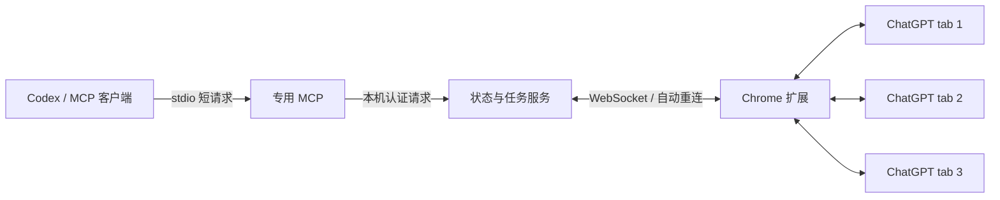

# ChatGPT Web Bridge

通过本机 Chrome 扩展控制已登录的 ChatGPT 网页。**2026-09-09 已在一台 Windows 电脑完成真实验收**：三个独立 tab 并发生图、选择并确认 GPT-5.5、查询生成状态、获取对应回答、下载并验证三张原图。本仓库提供源码；新环境需要自行生成本机配置、加载扩展并注册 MCP。

五个 ChatGPT tab、三个已完成任务的实测：MCP 全部状态缓存查询中位 **2.78 ms**，主动刷新中位 **18.95 ms**。这是本机短时样本。详见 [验收记录](ACCEPTANCE.md) 和 [安装与开发记录](WORKLOG.md)。

## 工作方式

提示词提交后返回持久化 `runId`，网页继续生成。后续查询使用短请求，不必让一个 MCP 调用一直等待生图完成。每个 tab 使用 Chrome profile、浏览器会话、tab ID 组合标识。



扩展观察网页控件并推送状态。`connection` 表示扩展连接，`activity` 表示网页活动，`freshness` 表示观测时间。断线、页面冻结、被丢弃或超过 30 秒没有观测时，活动返回 `unknown`；历史已完成任务及已验证文件仍可查询。

模型字段来自网页选择器。当前实测显示 `5.5\n即时`，对应模型菜单中选中的 `GPT-5.5`。`actualBackendModel:null` 表示不能从网页确认实际处理响应的后端模型。

## 组件与依赖

- Chrome 扩展 **ChatGPT Web Bridge (local)**，由本机 setup 生成。
- Codex stdio MCP **chatgpt-web-bridge**，提供 9 个工具。
- Skill **chatgpt-chrome-bridge**，源码见 [skill/SKILL.md](skill/SKILL.md)，可复制到个人 Codex skills 目录下的同名文件夹。
- 项目依赖：`@modelcontextprotocol/sdk@1.30.0`、`ws@8.21.3`、调研用 `chrome-devtools-mcp@1.9.0`；测试依赖 `jsdom@29.0.2`。使用现有 Node 24.13.0。

日常使用只需专用 Chrome 扩展和 MCP/CLI 服务。扩展权限为 `https://chatgpt.com/*`、storage、scripting、downloads、alarms。运行桥接不依赖 Chrome DevTools MCP，不需要远程调试。

## 使用

可直接对 AI 说：“使用 chatgpt-chrome-bridge，查看 Chrome 中所有 ChatGPT 标签页的模型与生成状态”，或“使用 Chrome 网页版 ChatGPT，开三个独立聊天并发生图，逐个确认模型后提交，最后给我对应原图”。

当前任务未加载新 MCP 工具时，Skill 可调用同一服务的 CLI：

```powershell
node src/cli.mjs health
node src/cli.mjs status
```

带参数时先写 UTF-8 JSON 文件，再用 `node src/cli.mjs <method> --input <参数文件>`。主动刷新参数是 `{"refresh":true}`。MCP/CLI 按需启动本机服务，Windows 使用隐藏后台窗口，没有创建开机任务。

| MCP 工具 | 作用 |
|---|---|
| `chatgpt_tabs` | 列出 tabKey、profile、网址；`action:new,count:3` 开三个新聊天 |
| `chatgpt_status` | 查询模型、活动、连接、新鲜度、任务；`refresh:true` 并行探测 |
| `chatgpt_models` | 读取实际模型菜单；必要时关闭没有草稿的图片查看器 |
| `chatgpt_select_model` | 按精确标签选择并读回，检查 `confirmed:true` |
| `chatgpt_send` | 提交 prompt，返回持久化 run；必须提供稳定 requestId |
| `chatgpt_result` | 按 runId 查询；`includeText:true` 读取对应 assistant 消息与图片哈希 |
| `chatgpt_download` | 点击对应图片保存控件，验证下载文件，返回路径 |
| `chatgpt_stop` | 停止指定 run 的当前生成 |
| `chatgpt_wait` | 最长 25 秒等待状态变化，超时后可继续查同一 run |

MCP 返回 structuredContent JSON，并附带相同内容的文本。状态字段示意如下，实际结果还包含 tabKey、网址和任务信息：

```json
{
  "model": {"label": "5.5\n即时", "source": "visible_model_picker", "actualBackendModel": null},
  "activity": "idle",
  "connection": "connected",
  "freshness": {"ageMs": 18, "stale": false},
  "surface": "conversation",
  "composerReady": true
}
```

`generating` / `thinking` 表示页面活动；具体任务成功以 `run.phase:completed` 为准。完成还要求关联到本次用户消息、新回答、结束控件、内容稳定以及图片确实加载。

## 三 tab 流程

1. 获取 profile，创建三个新聊天，等待空输入框与新鲜 idle 状态，取得各自精确 tabKey。
2. 每页读取 models，选择实际菜单标签并检查 confirmed；把读回的模型名称用于 send.expectedModel。
3. 为三个任务分别固定 requestId，分别提交，不等待前一个生成完成。
4. 用一次 status 查看全部任务；需要新观测时 refresh:true，各 tab 最多等 2 秒且并行执行；等待变化可用 wait。
5. 每个 run 完成后调用 result、download。同一 profile 的下载串行处理。

`submission_unknown` 表示网页是否接受尚未确认。先查询或用**相同 ID、相同参数**重试，不能换 ID 重发。重复请求返回 existing:true 和原 runId。已有草稿不会被覆盖。

## 原图验证

使用对应 assistant 回答的可见保存按钮。浏览器读取该回答已渲染图片的确切 URL 并计算 SHA-256，服务再与本机下载文件比对。不会构造 ChatGPT 私有接口请求，也不把截图当下载结果。

成功返回 `state:downloaded_and_verified`、`complete:true`，每个文件有 `originalVerified:true`、哈希、尺寸和路径，归档到 `artifacts/images/<runId>/original-1.png`。

`run.verifiedDownloads` 是已验证文件；`run.images` 仅是网页观测，其中 originalDownloadVerified:false 不代表已验证文件失效。下载事件收据也可能仍是 outcome_unknown：缺少 referrer 时事件关联不足，确切字节匹配可独立证明文件归属。

默认在当前 Windows 用户的 Downloads 文件夹检查近期、大小匹配的候选图片。Chrome 使用其他目录时，可在本机 runtime/connection.json 增加 downloadDirectory，保留其他字段并重启本项目服务。开启“每次询问保存位置”时需完成保存对话框。未匹配返回 verification_pending；重查相同 run 不重复点击。

## 安装与更新

在本项目目录运行：

```powershell
npm ci --ignore-scripts --no-audit --no-fund
npm run setup
powershell -NoProfile -File scripts/install-mcp.ps1
```

setup 生成 runtime/extension、固定扩展 ID、本机认证配置，不代替 Chrome 安装。首次使用，在 Chrome 扩展管理页“加载已解压的扩展程序”中选择 runtime/extension。上述 CLI 命令均在本子项目目录执行。

通用 MCP 客户端配置：

```json
{
  "mcpServers": {
    "chatgpt-web-bridge": {
      "command": "node",
      "args": ["<项目绝对路径>/chatgpt-web-bridge/src/mcp.mjs"]
    }
  }
}
```

替换示例中的绝对路径。Codex 安装脚本会自动解析当前目录和 Node 路径，不要把 JSON 直接放入 TOML。已运行任务未发现新工具时可先使用 CLI，客户端重新加载配置后使用 MCP。

已有实例的源码可以独立纳入本仓库，当前安装不会自动迁移。迁移运行实例时需保留其 runtime 配置和状态；环境变量 CHATGPT_BRIDGE_RUNTIME 可指定现有 runtime 目录。Chrome 扩展仍从加载时的目录运行，重新加载前应保留该目录。每个实例的认证配置需与其本地服务一致。

页面适配层更新后，npm run setup 和 node src/cli.mjs refresh_observers 可更新当前文档的观察器。修改 manifest 或 background 时需要在 Chrome 中重新加载扩展；当前 adapter 版本 18 已在实际页面读回。

## 验证范围与限制

- 当前本机 Chrome 152、已登录 ChatGPT 中文页面、GPT-5.5 菜单、三 tab 文生图和原图获取已验证；初次验收完成 60 次真实 MCP 状态查询，当前 32 个自动化测试通过。
- 重新加载扩展后，另行验证了 GPT-5.6 Sol → GPT-5.5 切换、新聊天、图片生成、阶段查询和原图下载。进度按 generating、finalizing、completed 等阶段返回，当前不提供生成百分比。
- 完成回答中的同源图片如果仍处于 lazy/pending，会启动加载；只有浏览器实际加载成功才允许任务完成。原始图片观测含 loadState 和 loading，便于区分等待加载与加载失败。
- 实际重启本地服务后约 619 ms 恢复五个 tab，期间返回 unknown，三个任务和下载哈希保留。
- 完整 Chrome 重启会产生新的 browserSessionId，目前不把旧 run 自动绑定到新 tab。可查旧记录，继续操作前重新获取 tabKey，不用旧数字 ID 猜关联。
- 网页改版可能需要更新 extension/adapter.js。图片编辑、附件、复杂研究模式、多 profile 并发和长期压力运行未纳入本次验收。
- 图片查看器有草稿时不会自动关闭；状态标记 surface:image_viewer、composerReady:false，避免误发到图片编辑框。没有草稿时 models 可关闭它并读取主聊天模型。

## 文件与撤销

extension/ 是扩展源码；src/ 是服务、状态机、MCP、CLI、下载校验；test/ 是行为测试。npm test 可重复检查。scripts/benchmark-live.mjs 复核已记录任务与速度，不新建生图请求；verify-live-images.py 用 Pillow 解码原图，仅用于验收；check-recovery.mjs 记录受控服务重启前后状态，本身不停止进程。

runtime/ 包含认证信息，artifacts/ 可能包含聊天内容和图片 URL，均已 Git 忽略，不作为公共源码分享。原始实机验收数据保留在本地，本仓库只提供验收摘要；依赖这些记录的 live 验证脚本需要先在本机采集证据。卸载 MCP 用 codex mcp remove chatgpt-web-bridge，Chrome 移除同名扩展，并移除个人安装的同名 Skill。开发记录见 WORKLOG.md。
